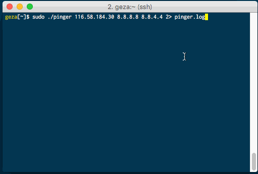

[](/LICENSE)
[](https://github.com/hirose31/pinger/actions/workflows/test.yml)
[](https://goreportcard.com/report/github.com/hirose31/pinger)
[](http://godoc.org/github.com/hirose31/pinger)

# Pinger

Pinger helps you to monitor many hosts using ICMP ECHO_REQUEST.

<p align="center">
  
</p>

# Installation

Download from [release page](https://github.com/hirose31/pinger/releases).

# Usage

```
pinger HOSTNAME_OR_IPADDR [HOSTNAME_OR_IPADDR ...]
```

`pinger` sends ICMP packets using raw socket, so requires root privileges.

- sudo pinger ...
- run by root
- `chown root pinger; chmod 4755 pinger` and run by normal user
- `setcap cap_net_raw=ep pinger` and run by normal user (Linux only)

You can write failed history to a file by redirecting stderr to a file.

```
$ sudo pinger example.com example.net 192.0.2.1 192.0.2.2 192.0.2.3 2> pinger.log
```

Two numerical numer are RTT and average of RTT (max latest 10 samples).


Push `ESC` or `C-c` to exit.

